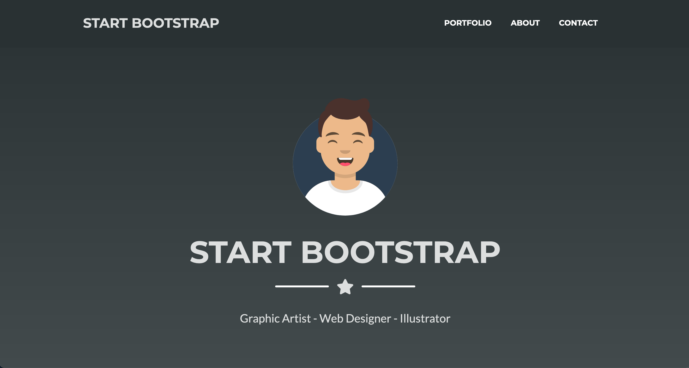

# [Start Bootstrap - Freelancer](https://startbootstrap.com/theme/freelancer/)

[Freelancer](https://startbootstrap.com/theme/freelancer/) is a one page, freelancer portfolio theme built with [Bootstrap](https://getbootstrap.com/) created by [Start Bootstrap](https://startbootstrap.com/). This theme features several content sections, a responsive portfolio grid, modal windows for each portfolio item, and a working PHP based contact form.

## Preview


### Live Preview
[Live Preview](https://chnuessli.github.io/startbootstrap-freelancer-dark/)

## Mother-Theme 

The basic theme of this dark-theme is the Freelancer Theme from Startbootstrap

See all about it there:

- [Download the latest release on Start Bootstrap](https://startbootstrap.com/theme/freelancer/)
- Install using npm: `npm i startbootstrap-freelancer`
- Clone the repo: `git clone https://github.com/StartBootstrap/startbootstrap-freelancer.git`
- [Fork, Clone, or Download on GitHub](https://github.com/StartBootstrap/startbootstrap-freelancer)

## Colors used in this theme

Maybe you want to know, otherwise just a note to my self.

### Dark-gray

```css
#293133
```

### Dark-stone

```css
#434b4d
```

#### Grey-text

```css
#dddfdf
```

## About

Start Bootstrap is an open source library of free Bootstrap themes and templates. All of the free themes and templates on Start Bootstrap are released under the MIT license, which means you can use them for any purpose, even for commercial projects.

- <https://startbootstrap.com>
- <https://twitter.com/SBootstrap>

Start Bootstrap was created by and is maintained by **[David Miller](https://davidmiller.io/)**.

- <https://davidmiller.io>
- <https://twitter.com/davidmillerhere>
- <https://github.com/davidtmiller>

Start Bootstrap is based on the [Bootstrap](https://getbootstrap.com/) framework created by [Mark Otto](https://twitter.com/mdo) and [Jacob Thorton](https://twitter.com/fat).

## Copyright and License

Copyright 2013-2020 Start Bootstrap LLC. Code released under the [MIT](https://github.com/StartBootstrap/startbootstrap-freelancer/blob/gh-pages/LICENSE) license.
